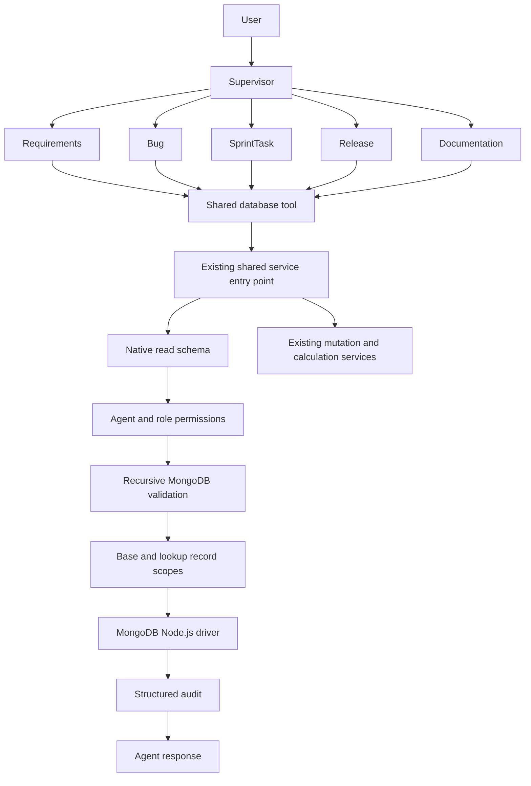

# Shared native MongoDB implementation report

## 1. Files inspected

- Agent definitions and execution: `src/config/agent-registry.ts`, `src/agent/router.ts`, `supervisor.ts`, `specialist-agent.ts`, `model.ts`, `db-tool.ts`, `schema-context.ts`.
- Data contracts and security: `src/types.ts`, `src/config/schema-registry.ts`, `src/security/policy.ts`, `guardrails.ts`.
- Driver, query mapper, business rules and audit: `src/db/mongodb.ts`, `src/services/database-action.service.ts`, `scope.service.ts`, `requirements-review.service.ts`, `src/repositories/user.repository.ts`.
- Entry points and review workflow: `app/api/chat/route.ts`, `app/api/schema/route.ts`, `app/api/requirements/review/route.ts`, `src/agent/requirements-draft-tool.ts`.
- Existing verification and project instructions: `AGENTS.md`, local Next.js route documentation, `package.json`, `tests/register-ts.cjs`, `tests/requirements-review.test.cjs`, `README.md`, `docs/ARCHITECTURE.md`.

## 2. Files changed

| File | Change |
| --- | --- |
| `src/db/mongo-action.ts` | Shared native read type and strict action schema |
| `src/security/mongo-policy.ts` | Central operator/stage allowlists, budgets and native read grants derived from existing policies |
| `src/security/mongo-validator.ts` | Recursive validation, field context tracking and typed value conversion |
| `src/services/mongo-read.service.ts` | Scope injection and MongoDB driver execution |
| `src/services/database-audit.service.ts` | Shared structured read/refusal audit with redaction |
| `src/services/database-action.service.ts` | Existing shared entry point dispatches native reads; old read execution and title fallback removed; business services retained |
| `src/agent/db-tool.ts` | One tool factory for every agent, accepting native read objects and existing business actions |
| `src/agent/specialist-agent.ts` | Native-query instructions, text search, joins, limits and business-service boundaries |
| `src/agent/schema-context.ts` | Native operation names, stored queryable fields, permissions and relationships |
| `src/security/policy.ts` | Central PM creation-review flags; aggregation removed from the blanket prohibition |
| `src/security/guardrails.ts` | Uses policy review flags, shared result cap and active-caller check |
| `src/services/scope.service.ts` | Reuses scope rules for native reads/joins; fixes feature ownership to `requestedBy`; bounds scope queries and rejects unsupported team scopes |
| `app/api/schema/route.ts` | Exposes native read capabilities and limits with existing policy metadata |
| `tests/native-mongo.test.cjs` | Native reads, all-agent policy coverage, joins, scope, limits and adversarial cases |
| `tests/native-mongo.integration.cjs` | Opt-in live driver checks without persisted writes |
| `tests/requirements-review.test.cjs` | Keeps approval/business regressions; migrates the graph read to native format and replaces obsolete legacy-read tests |
| `tests/run.cjs`, `package.json` | Runs both regression suites and exposes the integration command |
| `README.md`, `docs/ARCHITECTURE.md`, this report | Updated design, usage and limitations |

## 3. Old database flow

```text
User -> supervisor -> specialist -> custom conditionsJson/selectFieldsCsv
     -> typed action mapper -> permissions/scope/business rules -> MongoDB
```

Reads used custom operators such as `contains` and virtual relationship fields. The model could not propose a native aggregation pipeline.

## 4. New database flow



There is one agent-facing database tool factory. Native reads no longer use the custom read mapper. The old typed mutation/calculation contract remains because those actions encode business rules.

## 5. Shared action schema

```typescript
interface MongoReadAction {
  collection: string;
  operation: "find" | "findOne" | "countDocuments" | "aggregate";
  filter?: Record<string, unknown>;
  projection?: Record<string, unknown>;
  sort?: Record<string, 1 | -1>;
  limit?: number;
  skip?: number;
  pipeline?: Record<string, unknown>[];
  reason?: string;
}
```

Unknown top-level fields are rejected. `aggregate` requires a pipeline; filtering/projection/sorting belong in stages. `countDocuments` accepts only a filter and optional reason. `findOne` has no paging arguments. Business-action fields such as `conditionsJson` are rejected for native reads.

ObjectId values accept 24-hex strings or `{ "$oid": "..." }`; dates accept ISO timestamp strings or `{ "$date": "..." }`. Conversion applies only to literal positions whose registry field has that type. JavaScript, functions, RegExp objects and other non-JSON values are rejected.

## 6. Agent policy structure

The existing `POLICY[agent][role][collection]` stays authoritative for collections, operations, scope and mutable fields. `nativeOperations()` derives `findOne` from `find_one`, `countDocuments` from `count`, and read-only aggregation from `find`. Each lookup must satisfy that same grant.

The real agents remain `REQUIREMENTS`, `BUG`, `SPRINT_TASK`, `RELEASE` and `DOCUMENTATION`; no example-only collections or agent names were added. PM creation review is centralized as `creationReview: true` on the existing epic/story rules. Native code contains no agent-specific query builder.

## 7. Query validator

Validation happens before scope-resolution queries and target-collection reads. The schema registry supplies stored fields, types, queryability and selectability. Unknown fields, virtual business aliases in reads, invalid types, unsafe field names and unsupported operations fail closed. Business mutations still use their existing mutable-field allowlists.

## 8. Recursive filter validation

Allowed logical operators: `$and`, `$or`.

Allowed field operators: `$eq`, `$ne`, `$gt`, `$gte`, `$lt`, `$lte`, `$in`, `$nin`, `$exists`, `$not`, `$regex`, `$options`.

Every logical branch, `$not` operand and list element is checked. `$regex` is limited to literal text, optional anchors, escaped punctuation and word boundaries; only the `i` option is supported. Arbitrary quantified regex patterns are rejected. All regexes and values remain data.

## 9. Recursive aggregation validation

Allowed stages: `$match`, `$lookup`, `$unwind`, `$group`, `$project`, `$sort`, `$limit`, `$skip`, `$count`.

The validator tracks fields as stages change the document shape: joined aliases gain the target's validated fields; projections remove fields; groups/counts introduce defined outputs. Later references to unavailable fields fail. Every nested pipeline is validated using its foreign collection's schema.

Group accumulators: `$sum`, `$avg`, `$min`, `$max`, `$first`, `$last`. Expressions: field references, scalar constants, `$literal`, `$add`, `$subtract`, `$multiply`, `$divide`, `$ifNull`, `$size`. Variables such as `$$ROOT`, JavaScript functions, `$accumulator`, `$out`, `$merge`, `$unionWith`, `$facet` and unlisted expressions/stages are rejected.

## 10. Lookup permission validation

Supported forms are `from/localField/foreignField/as`, optionally with a pipeline, and `from/pipeline/as`. `let` and correlated `$expr` forms are rejected. Both equality fields must exist; aliases must be safe and cannot overwrite existing fields. Authorization is recursive: an authorized lookup into epics cannot conceal an unauthorized nested lookup into users.

After the complete query passes validation, the executor injects each foreign collection's OWN/ASSIGNED/TEAM scope before its user-supplied pipeline. A final safe projection prevents joined documents from exposing unregistered fields. This follows the [MongoDB lookup syntax](https://www.mongodb.com/docs/manual/reference/operator/aggregation/lookup/) while accepting a restricted subset.

## 11. MongoDB executor and limits

Trusted code calls `find`, `findOne`, `countDocuments` or `aggregate` on the Node.js driver. It never evaluates model text as code.

| Resource | Enforced limit |
| --- | --- |
| Returned top-level documents | 25 |
| Skip | 10,000 |
| Stages per pipeline | 20 |
| Total stages, including nested pipelines | 40 |
| Lookup count / nesting | 6 / 3 |
| JSON depth / visited nodes | 16 / 800 |
| `$in` / `$nin` values | 20 |
| Action size | 32 KB |
| Returned BSON payload | 1 MB |
| Driver `maxTimeMS` per query | 5 seconds |
| Aggregation disk spill | Disabled |

An independent terminal limit and bounded cursor consumption enforce output size even if the model omits `$limit`. One extra row is read to determine `hasMore`; at most 25 are returned. Cursors close on success, overflow and failure. Find uses a stable `_id` tie-breaker and returns `nextSkip`. Aggregate pagination requires an appropriate native `$skip`/`$sort` pipeline. Intermediate joins are bounded by server time/memory limits rather than silently truncating joined arrays before grouping. See [MongoDB driver aggregation limits](https://www.mongodb.com/docs/drivers/node/current/aggregation/).

## 12. Mutations and business services

Existing `insert_one`, `insert_many`, `update_one`, authorized `update_many`, and `calculate` actions retain their validated typed inputs. Native `update`, `insertOne`, `updateOne`, delete/drop and other arbitrary write operations are not enabled. Mixed native query/mutation payloads are rejected.

PM approval, transaction/idempotency logic, release sign-offs/readiness, approved-story task creation, task assignment and bug transitions remain in their existing services. The shared native read engine cannot mutate business data.

## 13. Audit handling

Native reads log user ID, role, agent, collection, operation, proposed action, validation result, execution status and timestamp. Rejected actions produce no target reads; the audit insert is the only database side effect. Existing mutation audit records now also include the explicit agent/operation/status metadata.

Credential-like keys, MongoDB connection strings, API-key patterns and bearer tokens are redacted; audit traversal is bounded. Results are not included in native read audit records. Successful reads are withheld if their audit cannot be written. On database/audit outages, failure logging is best effort and the operation remains failed. Existing approval audits remain inside their transactions.

## 14. Verification

Completed: **31 regression/security tests passed**, standalone TypeScript validation passed, **8 live Atlas read checks passed**, and the **Next.js production build passed**. The sandbox blocked network access and build-worker spawning; those checks passed with the corresponding execution permissions. Local tests/type checking used bounded Node heap settings after a process-memory failure.

`npm test` runs the preserved PM review regressions plus shared native-query tests across all five agents. Coverage includes normal reads/counts, description searches, typed IDs/dates, multiple and nested lookups, shape changes, base/foreign scope injection, unauthorized fields/collections/operations, nested operators, JavaScript/prototype payloads, destructive stages, resource limits, audit failure/redaction and native mutation bypass attempts.

`npm run test:integration` performs eight read-only checks against the configured MongoDB deployment: all five agents, two lookup pipelines, and task grouping. It uses `TEST_USER_ID` (default `u-pm-1`), captures audits in memory and performs no persisted writes. These checks succeeded against Atlas after enabling network access outside the sandbox.

The model itself is mocked in the graph regression tests. No live Groq response-quality or tool-generation evaluation has been performed for the new schema.

## 15. Example proposed actions

Requirements: approved requests.

```json
{"collection":"feature_requests","operation":"find","filter":{"status":"APPROVED"},"projection":{"featureRequestKey":1,"title":1,"status":1},"limit":25}
```

Bug: unresolved critical bugs (using the project's real statuses).

```json
{"collection":"bugs","operation":"find","filter":{"severity":"CRITICAL","status":{"$ne":"VERIFIED_CLOSED"}},"limit":25}
```

Sprint/Task: current sprint with tasks above five points. First read the sprint; use its returned ObjectId in the next query. The illustrative ObjectId below must be replaced by that result.

```json
{"collection":"sprints","operation":"find","filter":{"status":"ACTIVE"},"projection":{"_id":1,"sprintNumber":1,"name":1},"limit":25}
```

```json
{"collection":"tasks","operation":"find","filter":{"sprintId":{"$oid":"0123456789abcdef01234567"},"storyPoints":{"$gt":5}},"limit":25}
```

Release: unresolved critical bugs for a release.

```json
{"collection":"bugs","operation":"find","filter":{"affectedReleaseVersion":"v2.4","severity":"CRITICAL","status":{"$ne":"VERIFIED_CLOSED"}},"limit":25}
```

Documentation: literal text search.

```json
{"collection":"documents","operation":"find","filter":{"$or":[{"title":{"$regex":"release","$options":"i"}},{"content":{"$regex":"release","$options":"i"}}]},"limit":10}
```

Requirements: approved features with epics and related stories.

```json
{
  "collection": "feature_requests",
  "operation": "aggregate",
  "pipeline": [
    {"$match": {"status": "APPROVED"}},
    {"$lookup": {"from": "epics", "localField": "_id", "foreignField": "featureRequestId", "as": "epics"}},
    {"$unwind": {"path": "$epics", "preserveNullAndEmptyArrays": true}},
    {"$lookup": {"from": "user_stories", "localField": "epics._id", "foreignField": "epicId", "as": "stories"}},
    {"$project": {"featureRequestKey": 1, "title": 1, "epics.epicKey": 1, "stories.storyKey": 1}},
    {"$limit": 25}
  ]
}
```

## 16. Remaining limitations

- This is an explicit MongoDB subset. Operators, lookup forms or expression types not listed above require reviewed validator support.
- Literal regex searches may scan collections. Suitable indexes, real workload latency and deployment-specific quotas should be measured separately.
- Joined arrays are not capped independently, to avoid corrupting aggregation counts. Large joins can hit MongoDB's document/memory limits, the execution timeout or the response budget.
- Compound ObjectId/date literals in computed aggregation expressions are not supported; typed conversions apply to filters.
- Native reads use stored field names and values. Old automatic feature aliases/title fallbacks are not part of the new engine; the agent uses native text filters and explicit follow-up searches.
- Existing business actions keep their custom typed contracts. They were intentionally not replaced with unrestricted native writes.
- The real policy still prevents a Requirements agent from directly querying tasks or bugs; native joins cannot widen those grants. Cross-agent orchestration was not redesigned.
- Result pages are not database snapshots. Concurrent changes can affect subsequent pages.
- Aggregate `hasMore` describes the output of the submitted pipeline. An explicit user `$limit` can already truncate that pipeline; `hasMore: false` does not establish that every source record was included.
- Scope resolution may perform trusted metadata reads before the final target query, but only after complete action validation. Its execution timeout is per query, not an overall chat deadline.
- Existing caller selection is not production authentication. This refactor preserves it and does not introduce a new login system.
- Driver validation was verified against Atlas; new live Groq tool generation remains unmeasured. Older saved tool history may contain obsolete action formats; the system prompt specifies the new contract.
